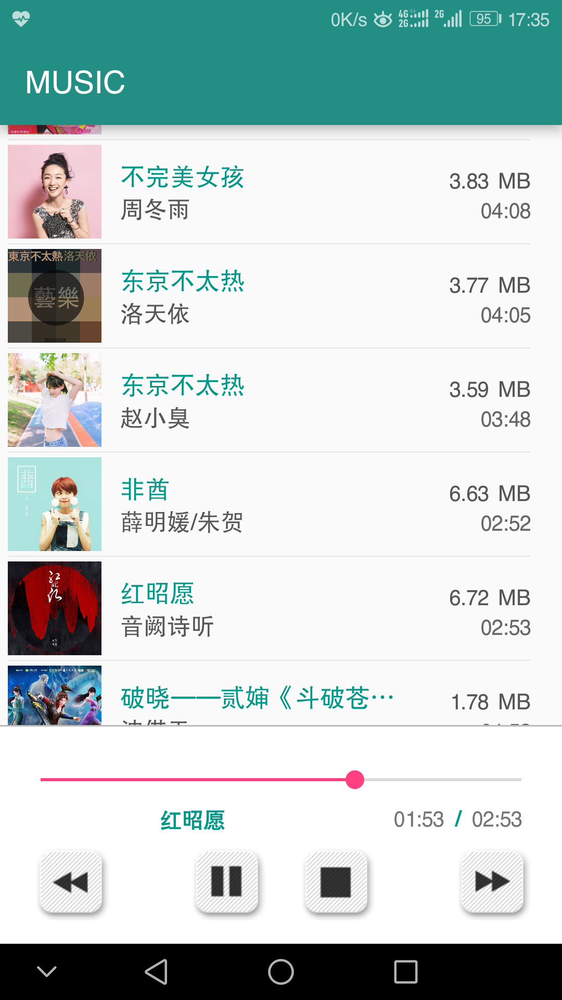

MUSIC
===

Android 音频播放app

功能说明
------
>* 自动搜索本地音乐（如若不显示，确保您手机内有音频的情况下， 重启之后再试）

>* 支持后台播放（Service后台服务），应用关闭至后台后依然可播放（但目前还没有快捷栏显示相应信息及操作）

>* 第三按键（停止键）为停止该应用服务，该状态下不能进行播放（甚至上下一首）功能，再次按下即启动服务后即可正常运行（该功能只应课程要求，无实际意义）

>* 目前仅有一个页面，暂未做具体播放页面及网络音乐播放

安装说明
------
>* 暂未在平台发布，安装时可能报错误警告，忽略警告直接安装即可

>* 安装时和第一次打开应用时可能没有相应的权限要求，本app应要 “存储”权限（仅获取本地音乐），可自行到手机的权限管理界面为app授权，否则会打不开。

**注：点击APP打开出现闪退情况的话，一般就是没有给“存储权限” **

下载：